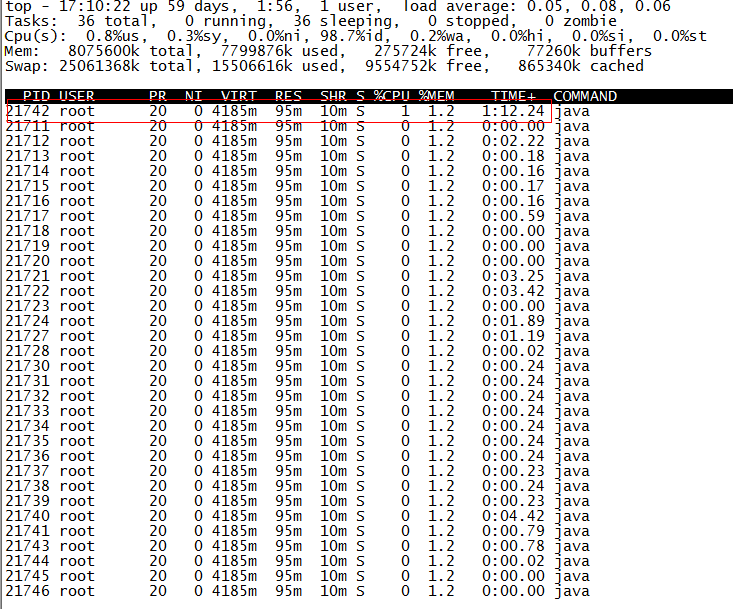

我们来一个实例找出某个Java进程中最耗费CPU的Java线程并定位堆栈信息，用到的命令有ps、top、printf、jstack、grep。
第一步先找出Java进程ID，我部署在服务器上的Java应用名称为mrf-center：

```
root@ubuntu:/# ps -ef | grep mrf-center | grep -v grep
root     21711     1  1 14:47 pts/3    00:02:10 java -jar mrf-center.jar
```
得到进程ID为21711，第二步找出该进程内最耗费CPU的线程，可以使用
`ps -Lfp pid`或者`ps -mp pid -o THREAD, tid, time`或者`top -Hp pid`，我这里用第三个，输出如下：



TIME列就是各个Java线程耗费的CPU时间，CPU时间最长的是线程ID为21742的线程，用

```
printf "%x\n" 21742
```
得到21742的十六进制值为54ee，下面会用到。
OK，下一步终于轮到jstack上场了，它用来输出进程21711的堆栈信息，然后根据线程ID的十六进制值grep，如下：
```
root@ubuntu:/# jstack 21711 | grep 54ee
"PollIntervalRetrySchedulerThread" prio=10 tid=0x00007f950043e000 nid=0x54ee in Object.wait() [0x00007f94c6eda000]
```

可以看到CPU消耗在PollIntervalRetrySchedulerThread这个类的Object.wait()，我找了下我的代码，定位到下面的代码：
```
// Idle wait
getLog().info("Thread [" + getName() + "] is idle waiting...");
schedulerThreadState = PollTaskSchedulerThreadState.IdleWaiting;
long now = System.currentTimeMillis();
long waitTime = now + getIdleWaitTime();
long timeUntilContinue = waitTime - now;
synchronized(sigLock) {
    try {
        if(!halted.get()) {
            sigLock.wait(timeUntilContinue);
        }
    } 
    catch (InterruptedException ignore) {
    }
}
```
它是轮询任务的空闲等待代码，上面的sigLock.wait(timeUntilContinue)就对应了前面的Object.wait()。

