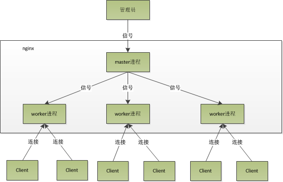

nginx在启动后，在unix系统中会以daemon的方式在后台运行，后台进程包含一个master进程和多个worker进程。我们可以看到，nginx是以多进程的方式来工作的，当然nginx也是支持多线程的方式的，只是我们主流的方式还是多进程的方式，也是nginx的默认方式。nginx采用多进程的方式有诸多好处，所以我就主要讲解nginx的多进程模式吧。

nginx在启动后，会有一个master进程和多个worker进程。master进程主要用来管理worker进程，包含：接收来自外界的信号，向各worker进程发送信号，监控worker进程的运行状态，当worker进程退出后(异常情况下)，会自动重新启动新的worker进程。而基本的网络事件，则是放在worker进程中来处理了。多个worker进程之间是对等的，他们同等竞争来自客户端的请求，各进程互相之间是独立的。一个请求，只可能在一个worker进程中处理，一个worker进程，不可能处理其它进程的请求。worker进程的个数是可以设置的，一般我们会设置与机器cpu核数一致，这里面的原因与nginx的进程模型以及事件处理模型是分不开的。nginx的进程模型，可以由下图来表示：

- 在nginx启动后，如果我们要操作nginx，要怎么做呢？从上文中我们可以看到，master来管理worker进程，所以我们只需要与master进程通信就行了。master进程会接收来自外界发来的信号，再根据信号做不同的事情。所以我们要控制nginx，只需要通过kill向master进程发送信号就行了。比如kill -HUP pid，则是告诉nginx，从容地重启nginx，我们一般用这个信号来重启nginx，或重新加载配置，因为是从容地重启，因此服务是不中断的。master进程在接收到HUP信号后是怎么做的呢？**（*从容的重启*）首先master进程在接到信号后，会先重新加载配置文件，然后再启动新的worker进程，并向所有老的worker进程发送信号，告诉他们可以光荣退休了。新的worker在启动后，就开始接收新的请求，而老的worker在收到来自master的信号后，就不再接收新的请求，并且在当前进程中的所有未处理完的请求处理完成后，再退出。**当然，直接给master进程发送信号，这是比较老的操作方式，nginx在0.8版本之后，引入了一系列命令行参数，来方便我们管理。比如，./nginx -s reload，就是来重启nginx，./nginx -s stop，就是来停止nginx的运行。如何做到的呢？我们还是拿reload来说，我们看到，执行命令时，我们是启动一个新的nginx进程，而新的nginx进程在解析到reload参数后，就知道我们的目的是控制nginx来重新加载配置文件了，它会向master进程发送信号，然后接下来的动作，就和我们直接向master进程发送信号一样了。

- worker进程又是如何处理请求的呢？我们前面有提到，worker进程之间是平等的，每个进程，处理请求的机会也是一样的。当我们提供80端口的http服务时，一个连接请求过来，每个进程都有可能处理这个连接，怎么做到的呢？首先，每个worker进程都是从master进程fork过来，在master进程里面，先建立好需要listen的socket（listenfd）之后，然后再fork出多个worker进程。所有worker进程的listenfd会在新连接到来时变得可读，为保证只有一个进程处理该连接，所有worker进程在注册listenfd读事件前抢accept_mutex，抢到互斥锁的那个进程注册listenfd读事件，在读事件里调用accept接受该连接。当一个worker进程在accept这个连接之后，就开始读取请求，解析请求，处理请求，产生数据后，再返回给客户端，最后才断开连接，这样一个完整的请求就是这样的了。我们可以看到，一个请求，完全由worker进程来处理，而且只在一个worker进程中处理。

- nginx采用这种进程模型有什么好处呢？当然，好处肯定会很多了。首先，对于每个worker进程来说，独立的进程，不需要加锁，所以省掉了锁带来的开销，同时在编程以及问题查找时，也会方便很多。其次，采用独立的进程，可以让互相之间不会影响，一个进程退出后，其它进程还在工作，服务不会中断，master进程则很快启动新的worker进程。当然，worker进程的异常退出，肯定是程序有bug了，异常退出，会导致当前worker上的所有请求失败，不过不会影响到所有请求，所以降低了风险。

- 有人可能要问了，nginx采用多worker的方式来处理请求，每个worker里面只有一个主线程，那能够处理的并发数很有限啊，多少个worker就能处理多少个并发，何来高并发呢？非也，这就是nginx的高明之处，nginx采用了异步非阻塞的方式来处理请求，也就是说，nginx是可以同时处理成千上万个请求的。想想apache的常用工作方式（apache也有异步非阻塞版本，但因其与自带某些模块冲突，所以不常用），每个请求会独占一个工作线程，当并发数上到几千时，就同时有几千的线程在处理请求了。这对操作系统来说，是个不小的挑战，线程带来的内存占用非常大，线程的上下文切换带来的cpu开销很大，自然性能就上不去了，而这些开销完全是没有意义的。

- 为什么nginx可以采用异步非阻塞的方式来处理呢，或者异步非阻塞到底是怎么回事呢？我们先回到原点，看看一个请求的完整过程。首先，请求过来，要建立连接，然后再接收数据，接收数据后，再发送数据。具体到系统底层，就是读写事件，而当读写事件没有准备好时，必然不可操作，如果不用非阻塞的方式来调用，那就得阻塞调用了，事件没有准备好，那就只能等了，等事件准备好了，你再继续吧。阻塞调用会进入内核等待，cpu就会让出去给别人用了，对单线程的worker来说，显然不合适，当网络事件越多时，大家都在等待呢，cpu空闲下来没人用，cpu利用率自然上不去了，更别谈高并发了。好吧，你说加进程数，这跟apache的线程模型有什么区别，注意，别增加无谓的上下文切换。所以，在nginx里面，最忌讳阻塞的系统调用了。不要阻塞，那就非阻塞喽。非阻塞就是，事件没有准备好，马上返回EAGAIN，告诉你，事件还没准备好呢，你慌什么，过会再来吧。好吧，你过一会，再来检查一下事件，直到事件准备好了为止，在这期间，你就可以先去做其它事情，然后再来看看事件好了没。虽然不阻塞了，但你得不时地过来检查一下事件的状态，你可以做更多的事情了，但带来的开销也是不小的。所以，才会有了异步非阻塞的事件处理机制，具体到系统调用就是像select/poll/epoll/kqueue这样的系统调用。它们提供了一种机制，让你可以同时监控多个事件，调用他们是阻塞的，但可以设置超时时间，在超时时间之内，如果有事件准备好了，就返回。这种机制正好解决了我们上面的两个问题，拿epoll为例(在后面的例子中，我们多以epoll为例子，以代表这一类函数)，当事件没准备好时，放到epoll里面，事件准备好了，我们就去读写，当读写返回EAGAIN时，我们将它再次加入到epoll里面。这样，只要有事件准备好了，我们就去处理它，只有当所有事件都没准备好时，才在epoll里面等着。这样，我们就可以并发处理大量的并发了，当然，这里的并发请求，是指未处理完的请求，线程只有一个，所以同时能处理的请求当然只有一个了，只是在请求间进行不断地切换而已，切换也是因为异步事件未准备好，而主动让出的。这里的切换是没有任何代价，你可以理解为循环处理多个准备好的事件，事实上就是这样的。与多线程相比，这种事件处理方式是有很大的优势的，不需要创建线程，每个请求占用的内存也很少，没有上下文切换，事件处理非常的轻量级。并发数再多也不会导致无谓的资源浪费（上下文切换）。更多的并发数，只是会占用更多的内存而已。 我之前有对连接数进行过测试，在24G内存的机器上，处理的并发请求数达到过200万。现在的网络服务器基本都采用这种方式，这也是nginx性能高效的主要原因。

# 参考
[Nginx开发从入门到精通](http://tengine.taobao.org/book/index.html)