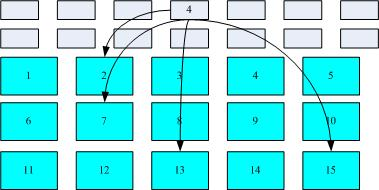
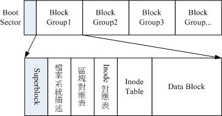

# 文件权限
## 改变权限, chmod
文件权限的改变使用的是chmod这个指令，但是，权限的设定方法有两种， 分别可以使用数字或者是符号来进行权限的变更。我们就来谈一谈：

### 数字类型改变文件权限
我们可以使用数字来代表各个权限，各权限的分数对照表如下：
```tex?linenums
r:4
w:2
x:1
```
每种身份(owner/group/others)各自的三个权限(r/w/x)分数是需要累加的，例如当权限为： [-rwxrwx---] 分数则是：
``` tex?linenums
owner = rwx = 4+2+1 = 7
group = rwx = 4+2+1 = 7
others= --- = 0+0+0 = 0
```
所以等一下我们设定权限的变更时，该文件的权限数字就是770啦！变更权限的指令chmod的语法是这样的：

``` tex?linenums
[root@www ~]# chmod [-R] xyz 文件或目录
选项与参数：
xyz : 就是刚刚提到的数字类型的权限属性，为 rwx 属性数值的相加。
-R : 进行递归(recursive)的持续变更，亦即连同次目录下的所有文件都会变更
```
举例：
``` tex?linenums
[root@192 zch]# ls -ld test/
drwxr--r--. 2 root root 19 7月  24 18:10 test/
[root@192 zch]# chmod 755 test
[root@192 zch]# ls -ld test/
drwxr-xr-x. 2 root root 19 7月  24 18:10 test/
```

### 符号类型改变文件权限
还有一个改变权限的方法呦！从之前的介绍中我们可以发现，基本上就九个权限分别是(1)user (2)group (3)others三种身份啦！那么我们就可以藉由u, g, o来代表三种身份的权限！此外， a 则代表 all 亦即全部的身份！那么读写的权限就可以写成r, w, x！也就是可以使用底下的方式来看：


举例
``` tex?linenums
[root@192 zch]# ls -ld test/
drwxr-xr-x. 2 root root 19 7月  24 18:10 test/
[root@192 zch]# chmod u=rwx,go=r test
# 注意喔！那个 u=rwx,go=rx 是连在一起的，中间并没有任何空格！
[root@192 zch]# ls -ld test
drwxr--r--. 2 root root 19 7月  24 18:10 test
[root@192 zch]# chmod go+x test
[root@192 zch]# ls -ld test
drwxr-xr-x. 2 root root 19 7月  24 18:10 test
```

## 权限对目录的重要性

 - r (read contents in directory)：
表示具有读取目录结构列表的权限，所以当你具有读取(r)一个目录的权限时，表示你可以查询该目录下的文件名数据。 所以你就可以利用 ls 这个指令将该目录的内容列表显示出来！

- w (modify contents of directory)：
这个可写入的权限对目录来说，是很了不起的！ 因为他表示你具有异动该目录结构列表的权限，也就是底下这些权限：
建立新的文件与目录；
删除已经存在的文件与目录(不论该文件的权限为何！)
将已存在的文件或目录进行更名；
搬移该目录内的文件、目录位置。
总之，目录的w权限就与该目录底下的文件名异动有关就对了啦！

- x (access directory)：
咦！目录的执行权限有啥用途啊？目录只是记录文件名而已，总不能拿来执行吧？没错！目录不可以被执行，目录的x代表的是用户能否进入该目录成为工作目录的用途！ 所谓的工作目录(work directory)就是你目前所在的目录啦！举例来说，当你登入Linux时， 你所在的家目录就是你当下的工作目录。而变换目录的指令是『cd』(change directory)啰！
大致的目录权限概念是这样，底下我们来看几个范例，让你了解一下啥是目录的权限啰！

- 例题：
有个目录的权限如下所示：
drwxr--r--  3  root  root  4096   Jun 25 08:35   .ssh
系统有个账号名称为vbird，这个账号并没有支持root群组，请问vbird对这个目录有何权限？是否可切换到此目录中？
答：
vbird对此目录仅具有r的权限，因此vbird可以查询此目录下的文件名列表。因为vbird不具有x的权限， 因此vbird并不能切换到此目录内！(相当重要的概念！)

- 举例
``` tex?linenums
[root@192 zch]# ls -ld test
drwxr--r--. 2 root root 19 7月  24 18:10 test
[root@192 zch]# su zch
[zch@192 ~]$ ls -ld test
drwxr--r--. 2 root root 19 7月  24 18:10 test
[zch@192 ~]$ ls -l test/
ls: 无法访问test/hh.txt: 权限不够
总用量 0
?????????? ? ? ? ?            ? hh.txt
[zch@192 ~]$ cd test/
bash: cd: test/: 权限不够
```

# 目录配置
## FHS(Filesystem Hierarchy Standard)

- / (root, 根目录)：与开机系统有关；
- /usr (unix software resource)：与软件安装/执行有关；
- /var (variable)：与系统运作过程有关。
- /etc：配置文件
- /bin：重要执行文件
- /dev：所需要的装置文件
- /lib：执行档所需的函式库与核心所需的模块
- /sbin：重要的系统执行文件

# 目录与路径

比较特殊的目录：
``` tex?linenums
.         代表此层目录
..        代表上一层目录
-         代表前一个工作目录
~         代表『目前使用者身份』所在的家目录
~account  代表 account 这个使用者的家目录(account是个帐号名称)
```
## 关於运行文件路径的变量： $PATH
『为什么我可以在任何地方运行/bin/ls这个命令呢？ 』 为什么我在任何目录下输入 ls 就一定可以显示出一些信息而不会说找不到该 /bin/ls 命令呢？ 这是因为环境变量 PATH 的帮助所致呀！
``` tex?linenums
范例：先用root的身份列出搜寻的路径为何？
[root@www ~]# echo $PATH
/usr/kerberos/sbin:/usr/kerberos/bin:/usr/local/sbin:/usr/local/bin:/sbin
:/bin:/usr/sbin:/usr/bin:/root/bin  <==这是同一行！

范例：用vbird的身份列出搜寻的路径为何？
[root@www ~]# su - vbird
[vbird@www ~]# echo $PATH
/usr/kerberos/bin:/usr/local/bin:/bin:/usr/bin:/home/vbird/bin
# 仔细看，一般用户vbird的PATH中，并不包含任何『sbin』的目录存在喔！
```
PATH(一定是大写)这个变量的内容是由一堆目录所组成的，每个目录中间用冒号(:)来隔开， 每个目录是有『顺序』之分的。

- 不同身份使用者默认的PATH不同，默认能够随意运行的命令也不同(如root与vbird)；
- PATH是可以修改的，所以一般使用者还是可以透过修改PATH来运行某些位於/sbin或/usr/sbin下的命令来查询；
- 使用绝对路径或相对路径直接指定某个命令的档名来运行，会比搜寻PATH来的正确；
- 命令应该要放置到正确的目录下，运行才会比较方便；
- 本目录(.)最好不要放到PATH当中。


# 文件与目录管理
## 文件搜寻 find
``` tex?linenums
[root@www ~]# find [PATH] [option] [action]
选项与参数：
1. 与时间有关的选项：共有 -atime, -ctime 与 -mtime ，以 -mtime 说明
   -mtime  n ：n 为数字，意义为在 n 天之前的『一天之内』被更动过内容的文件；
   -mtime +n ：列出在 n 天之前(不含 n 天本身)被更动过内容的文件档名；
   -mtime -n ：列出在 n 天之内(含 n 天本身)被更动过内容的文件档名。
   -newer file ：file 为一个存在的文件，列出比 file 还要新的文件档名
   
范例一：将过去系统上面 24 小时内有更动过内容 (mtime) 的文件列出
[root@www ~]# find / -mtime 0
# 那个 0 是重点！0 代表目前的时间，所以，从现在开始到 24 小时前，
# 有变动过内容的文件都会被列出来！那如果是三天前的 24 小时内？
# find / -mtime 3 有变动过的文件都被列出的意思！

范例二：寻找 /etc 底下的文件，如果文件日期比 /etc/passwd 新就列出
[root@www ~]# find /etc -newer /etc/passwd
# -newer 用在分辨两个文件之间的新旧关系是很有用的！   
```
时间参数真是挺有意思的！我们现在知道 atime, ctime 与 mtime 的意义，如果你想要找出一天内被更动过的文件名称， 可以使用上述范例一的作法。但如果我想要找出『4天内被更动过的文件档名』呢？那可以使用『 find /var -mtime -4 』。那如果是『4天前的那一天』就用『 find /var -mtime 4 』。有没有加上『+, -』差别很大喔！我们可以用简单的图示来说明一下：


图中最右边为目前的时间，越往左边则代表越早之前的时间轴啦。由图5.2.1我们可以清楚的知道：

- +4代表大於等於5天前的档名：ex> find /var -mtime +4
- -4代表小於等於4天内的文件档名：ex> find /var -mtime -4
- 4则是代表4-5那一天的文件档名：ex> find /var -mtime 4

非常有趣吧！你可以在 /var/ 目录下搜寻一下，感受一下输出文件的差异喔！再来看看其他 find 的用法吧！

```tex?linenums
选项与参数：
2. 与文件权限及名称有关的参数：
   -name filename：搜寻文件名称为 filename 的文件；
   -size [+-]SIZE：搜寻比 SIZE 还要大(+)或小(-)的文件。这个 SIZE 的规格有：
                   c: 代表 byte， k: 代表 1024bytes。所以，要找比 50KB
                   还要大的文件，就是『 -size +50k 』
   -type TYPE    ：搜寻文件的类型为 TYPE 的，类型主要有：一般正规文件 (f),
                   装置文件 (b, c), 目录 (d), 连结档 (l), socket (s), 
                   及 FIFO (p) 等属性。
   -perm mode  ：搜寻文件权限『刚好等於』 mode 的文件，这个 mode 为类似 chmod
                 的属性值，举例来说， -rwsr-xr-x 的属性为 4755 ！
   -perm -mode ：搜寻文件权限『必须要全部囊括 mode 的权限』的文件，举例来说，
                 我们要搜寻 -rwxr--r-- ，亦即 0744 的文件，使用 -perm -0744，
                 当一个文件的权限为 -rwsr-xr-x ，亦即 4755 时，也会被列出来，
                 因为 -rwsr-xr-x 的属性已经囊括了 -rwxr--r-- 的属性了。
   -perm +mode ：搜寻文件权限『包含任一 mode 的权限』的文件，举例来说，我们搜寻
                 -rwxr-xr-x ，亦即 -perm +755 时，但一个文件属性为 -rw-------
                 也会被列出来，因为他有 -rw.... 的属性存在！
				 
# 找出档名为 test1 这个文件
[zch@192 ~]$ find . -name test1
./test1
# 这个 -type 的属性也很有帮助喔！
[root@192 zch]# touch test/test1
[root@192 zch]# find -name test1 -type d #查找名为test1的目录
./test1
[root@192 zch]# find -name test1 -type f #查找名为test1的文件
./test/test1

# 正则查询
[zch@192 ~]$ find . -regex .*txt
./.mozilla/firefox/mloqpkz5.default/revocations.txt
./.mozilla/firefox/mloqpkz5.default/SiteSecurityServiceState.txt
./test/hh.txt
./test1.txt

```

# 磁盘与文件系统管理
## EXT2文件系统
### 索引式文件系统
文件系统通常会将权限与属性放置到 inode 中，至于实际数据则放置到 data block 区块中。 另外，还有一个超级区块 (superblock) 会记录整个文件系统的整体信息，包括 inode 与 block 的总量、使用量、剩余量等。
每个 inode 与 block 都有编号，至于这三个数据的意义可以简略说明如下：

- superblock：记录此 filesystem 的整体信息，包括inode/block的总量、使用量、剩余量， 以及文件系统的格式与相关信息等；
- inode：记录文件的属性，一个文件占用一个inode，同时记录此文件的数据所在的 block 号码；
- block：实际记录文件的内容，若文件太大时，会占用多个 block 。

由于每个 inode 与 block 都有编号，而每个文件都会占用一个 inode ，inode 内则有文件数据放置的 block 号码。 因此，我们可以知道的是，如果能够找到文件的 inode 的话，那么自然就会知道这个文件所放置数据的 block 号码， 当然也就能够读出该文件的实际数据了。这是个比较有效率的作法，因为如此一来我们的磁盘就能够在短时间内读取出全部的数据， 读写的效能比较好啰。
我们将 inode 与 block 区块用图解来说明一下：


这种数据存取的方法我们称为索引式文件系统(indexed allocation)
###  EXT2 文件系统(inode)
前一小节我们知道 filesystem 里面可能含有的 inode/block/superblock 等。为什么要谈这个呢？因为标准的 Linux 文件系统 Ext2 就是使用这种 inode 为基础的文件系统啦！

而如同前一小节所说的，inode 的内容在记录文件的权限与相关属性，至于 block 区块则是在记录文件的实际内容。 而且文件系统一开始就将 inode 与 block 规划好了，除非重新格式化(或者利用 resize2fs 等命令变更文件系统大小)，否则 inode 与 block 固定后就不再变动。但是如果仔细考虑一下，如果我的文件系统高达数百GB时， 那么将所有的 inode 与 block 通通放置在一起将是很不智的决定，因为 inode 与 block 的数量太庞大，不容易管理。

为此之故，因此 Ext2 文件系统在格式化的时候基本上是区分为多个区块群组 (block group) 的，每个区块群组都有独立的 inode/block/superblock 系统。感觉上就好像我们在当兵时，一个营里面有分成数个连，每个连有自己的联络系统， 但最终都向营部回报连上最正确的信息一般！这样分成一群群的比较好管理啦！整个来说，Ext2 格式化后有点像底下这样：



#### data block (数据区块)
data block 是用来放置文件内容数据地方，在 Ext2 文件系统中所支持的 block 大小有 1K, 2K 及 4K 三种而已。在格式化时 block 的大小就固定了，且每个 block 都有编号，以方便 inode 的记录啦。 不过要注意的是，由于 block 大小的差异，会导致该文件系统能够支持的最大磁盘容量与最大单一文件容量并不相同。 因为 block 大小而产生的 Ext2 文件系统限制如下：


你需要注意的是，虽然 Ext2 已经能够支持大于 2GB 以上的单一文件容量，不过某些应用程序依然使用旧的限制， 也就是说，某些程序只能够捉到小于 2GB 以下的文件而已，这就跟文件系统无关了！
除此之外 Ext2 文件系统的 block 还有什么限制呢？有的！基本限制如下：
- 原则上，block 的大小与数量在格式化完就不能够再改变了(除非重新格式化)；
- 每个 block 内最多只能够放置一个文件的数据；
- 承上，如果文件大于 block 的大小，则一个文件会占用多个 block 数量；
- 承上，若文件小于 block ，则该 block 的剩余容量就不能够再被使用了(磁盘空间会浪费)。

# 参考文档
- [鸟哥的linux私房菜](http://cn.linux.vbird.org/linux_basic/linux_basic.php)